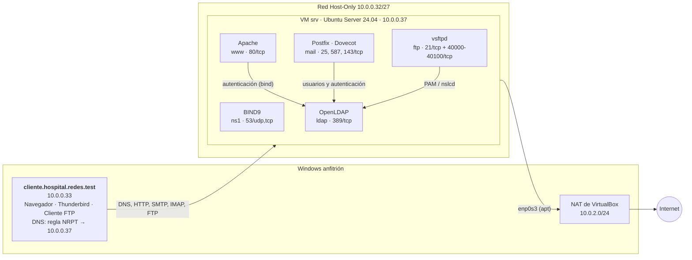

# Diagrama de red local

Red del laboratorio: **subred de servidores del proyecto, `10.0.0.32/27`** (Host-Only de VirtualBox).
La VM tiene una segunda interfaz NAT que solo se usa para descargar paquetes.

| Equipo | Interfaz | Dirección | Función |
|---|---|---|---|
| VM `srv` | `enp0s8` | `10.0.0.37/27` (estática) | Todos los servicios del laboratorio |
| VM `srv` | `enp0s3` | DHCP (NAT) | Solo salida a Internet |
| Windows | Host-Only #2 | `10.0.0.33/27` | Cliente de pruebas |
